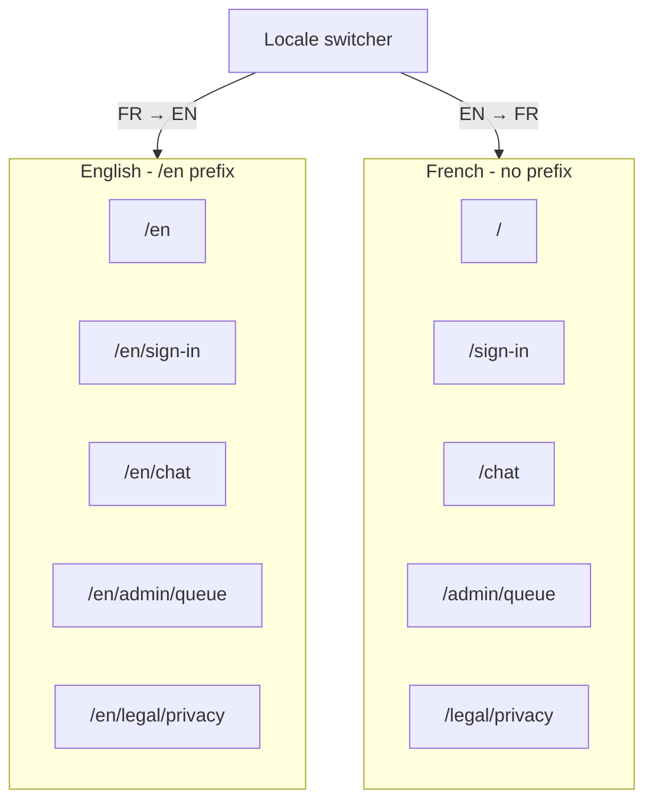

# Internationalisation with URL locales (FR default, EN under `/en`)

**Status:** Partial — URL routing and locale switcher implemented; see [feat-0036](./feat-0036/PRODUCT.md) for landing chat/brand links.

**Default locale:** `fr` — **no URL prefix**

**English locale:** `en` — **prefix `/en`**

**Supersedes:** URL routing sections of [I18N_SPEC.md](./I18N_SPEC.md) and defers cookie-only MVP in [feat-0034](./feat-0034/PRODUCT.md) Phase 4.

---

## 1. Summary

Every page and product feature in the Afalambe web app must be available in **French and English**. French is the **default locale** and uses **clean URLs** (`/chat`, `/sign-in`, `/`). English uses the **`/en` prefix** (`/en/chat`, `/en/sign-in`, `/en`).

The **URL is the source of truth** for UI locale. A user on `/en/chat` always sees English chrome; a user on `/chat` always sees French chrome. The locale switcher **navigates** to the equivalent path in the other language instead of only toggling client state.

**Claim language** (text submitted to AI, `Claim.claimLanguage`) remains a **separate** concern — see [feat-0014](./feat-0014/PRODUCT.md).



---

## 2. Goals

| Goal | Detail |
|------|--------|
| **Predictable URLs** | Shareable links preserve language (`/en/chat` stays English). |
| **SEO** | `hreflang`, canonical, and metadata per locale path. |
| **Full coverage** | Every route, chrome string, toast, validation message, admin surface, legal page, and system error page has FR + EN copy. |
| **No mixed chrome** | Selecting English via URL must not leave French labels anywhere in product UI. |
| **French-first** | Unprefixed paths are authoritative French; no `/fr` prefix. |

## 3. Non-goals

- **`/fr/*` prefix** — French uses unprefixed paths only.
- **Fula (`ff`) product chrome** — claim input only ([feat-0014](./feat-0014/PRODUCT.md)).
- **Auto-translation of user claims or AI replies** in this spec.
- **RTL layout**.
- **Localized API error codes** as a first step (client wrappers must localize; server messages may stay bilingual later).

---

## 4. URL map (complete route inventory)

### 4.1 Public and marketing

| French (default) | English | Feature |
|------------------|---------|---------|
| `/` | `/en` | Landing hero, features, FAQ, footer |
| `/demo` | `/en/demo` | Public scripted chat preview ([feat-0035](./feat-0035/PRODUCT.md)) |
| `/legal/privacy` | `/en/legal/privacy` | Privacy policy body + chrome |
| `/legal/terms` | `/en/legal/terms` | Terms body + chrome |

### 4.2 Authentication

| French | English | Feature |
|--------|---------|---------|
| `/sign-in` | `/en/sign-in` | Login form, shell, metadata |
| `/sign-up` | `/en/sign-up` | Registration form |
| `/sign-up/verify` | `/en/sign-up/verify` | Email OTP verification |
| `/forgot-password` | `/en/forgot-password` | Reset request |
| `/reset-password` | `/en/reset-password` | New password (token in query) |

### 4.3 Product (authenticated)

| French | English | Feature |
|--------|---------|---------|
| `/chat` | `/en/chat` | Threads, composer, uploads, toasts, outbox, realtime |

### 4.4 Admin (role-gated)

| French | English | Feature |
|--------|---------|---------|
| `/admin` | `/en/admin` | Admin entry redirect |
| `/admin/queue` | `/en/admin/queue` | Review queue list |
| `/admin/claims/[id]` | `/en/admin/claims/[id]` | Claim detail + resolve form |

### 4.5 System

| French | English | Notes |
|--------|---------|-------|
| N/A (shared) | N/A | `not-found`, `error`, `global-error` — locale from path when inside `/en/*`, else `fr` |

### 4.6 Out of web URL scope (still must be translated per “every feature”)

| Surface | Spec | Phase |
|---------|------|-------|
| Transactional email HTML | [feat-0011](./feat-0011/PRODUCT.md) | 2 |
| tRPC user-visible errors | [feat-0023](./feat-0023/PRODUCT.md) | 2 |
| OpenAI system prompts | [feat-0014](./feat-0014/PRODUCT.md) | Already multilingual instruction |

---

## 5. Locale resolution (new rules)

**Priority order:**

1. **URL path** — `/en/...` → `en`; otherwise → `fr`
2. **No browser `Accept-Language` override** of URL (path wins)
3. **Cookie `afalambe_locale`** — sync *from* URL on navigation (for metadata helpers during migration), not the other way around
4. **`localStorage`** — optional mirror for client hooks; updated when path changes

**Forbidden:** French chrome on `/en/*` or English chrome on unprefixed paths (except brand name **Afalambè** / **Afalambe**).

### 5.1 Locale switcher behaviour

| Current path | Action |
|--------------|--------|
| `/chat` | Navigate to `/en/chat` |
| `/en/chat` | Navigate to `/chat` |
| `/sign-in?next=/chat` | Navigate to `/en/sign-in?next=/en/chat` |
| `/admin/claims/clm_abc` | Navigate to `/en/admin/claims/clm_abc` |

Implementation: `localizedPath(pathname, targetLocale)` in `apps/web/lib/localized-path.ts`.

### 5.2 Redirects and guards

| Request | Response |
|---------|----------|
| `/fr/chat` | **301** → `/chat` (no `/fr` namespace) |
| `/en` (no trailing path) | **200** — English landing |
| `/en/fr/chat` | **404** |
| Logged-out user → `/chat` | Redirect to `/sign-in` (or `/en/sign-in` if path under `/en`) |
| Non-admin → `/admin/*` | Redirect per existing guard, preserving locale prefix |

---

## 6. Architecture

### 6.1 Recommended approach: `next-intl` with `localePrefix: 'as-needed'`

| Setting | Value |
|---------|-------|
| `locales` | `['fr', 'en']` |
| `defaultLocale` | `fr` |
| `localePrefix` | `as-needed` (French unprefixed, English `/en`) |
| Routing | App Router `[locale]` segment **or** next-intl middleware + path matcher |

**Alternative (no new dependency):** Next.js `middleware.ts` strips/adds `/en`, sets `x-ui-locale` header, duplicate thin `app/en/**/page.tsx` re-exports shared components with `locale="en"`.

**Decision:** Prefer **`next-intl`** if team accepts the dependency; otherwise **middleware + `app/en` mirror tree**.

### 6.2 File structure (target)

```text
apps/web/
  middleware.ts                    # Locale detection, /fr redirect, prefix strip
  lib/
    localized-path.ts              # path ↔ locale helpers
    ui-locale.ts                   # Existing bundles (unchanged keys)
    landing-content.ts
    legal-content.ts
  app/
    (marketing)/page.tsx           # FR landing at /
    (marketing)/legal/...
    sign-in/page.tsx               # FR auth
    chat/page.tsx                  # FR chat
    admin/...
    en/
      (marketing)/page.tsx         # EN landing at /en
      sign-in/page.tsx
      chat/page.tsx
      admin/...
      legal/...
```

Or with `next-intl`:

```text
app/[locale]/chat/page.tsx        # locale validated; fr renders as /chat via prefix config
```

### 6.3 Message bundles

Keep existing bundles in [`apps/web/lib/ui-locale.ts`](../apps/web/lib/ui-locale.ts). Pages receive `locale: UiLocale` from:

- Server: `getLocaleFromPathname(pathname)` or `getRequestLocale()`
- Client: `usePathname()` + parser, or `useLocale()` from `next-intl`

**Do not duplicate copy in page files.**

### 6.4 Links and navigation

All internal `<Link href>` and `router.push` must use:

```ts
import { localizedHref } from '@/lib/localized-path';

<Link href={localizedHref('/chat', locale)} />
```

Audit: `grep` for `href="/` and `router.push('/` in `apps/web`.

### 6.5 Metadata and SEO

| Item | French path | English path |
|------|-------------|--------------|
| `<html lang>` | `fr` on `/chat` | `en` on `/en/chat` |
| `title` / `description` | `CHAT_PAGE_META.fr`, etc. | `CHAT_PAGE_META.en` |
| `canonical` | `https://afalambe.org/chat` | `https://afalambe.org/en/chat` |
| `hreflang` | `fr` + `en` alternates on every public page | Same |
| `openGraph.locale` | `fr_FR` | `en_US` |
| JSON-LD `inLanguage` | `fr` | `en` |

`generateMetadata` reads locale from **path**, not cookie alone.

### 6.6 `@afalambe/ui` package

Shared UI stays **prop-driven** (no locale hooks inside `packages/ui`). Web passes translated strings from `ui-locale` bundles based on path locale.

---

## 7. Feature translation checklist

Every row must pass **UC-RT01** (no wrong-language chrome on that route).

### 7.1 Marketing

- [ ] Header nav, CTAs, hero, steps, FAQ, features grid
- [ ] Footer columns, tagline, copyright, legal nav aria
- [ ] Hero chat preview sample prompts
- [ ] FAQ JSON-LD matches visible FAQ language

### 7.2 Auth

- [ ] Page shells (title, description, footer)
- [ ] Form labels, validation, password hints, show/hide password aria
- [ ] Toasts (login failed, reset sent, etc.)
- [ ] `generateMetadata` per route

### 7.3 Chat

- [ ] Sidebar (new chat, search, history aria, footer)
- [ ] Top bar, composer (placeholder, offline, disclaimer, all aria)
- [ ] Message actions (copy, regenerate, thumbs)
- [ ] Verdict badges, claim metadata labels
- [ ] Toasts (send, image, outbox, feedback, regenerate)
- [ ] Image validation messages
- [ ] Empty-state home columns + prompt suggestions
- [ ] Typing indicator aria

### 7.4 Admin

- [ ] Queue table headers, filters, search, audit log
- [ ] Claim detail, resolve form, status labels
- [ ] Guard loading text
- [ ] Page metadata

### 7.5 Legal

- [ ] Privacy + terms full body ([`legal-content.ts`](../apps/web/lib/legal-content.ts))
- [ ] Document chrome (last updated, draft notice, back home)

### 7.6 System

- [ ] `not-found`, `error`, `global-error` — FR on default paths, EN under `/en/*`
- [ ] Theme toggle aria
- [ ] API toast fallbacks ([`api-toast.ts`](../apps/web/lib/api-toast.ts))

### 7.7 Cross-cutting

- [ ] Locale switcher visible on all product routes
- [ ] Post-login redirect preserves locale (`/en/sign-in` → `/en/chat`)
- [ ] Password reset email links include locale path when templates support it (Phase 2)

---

## 8. Use case catalog

| ID | Use case | Acceptance criteria |
|----|----------|---------------------|
| **UC-RT01** | French chat at `/chat` | All chat chrome in French |
| **UC-RT02** | English chat at `/en/chat` | All chat chrome in English; zero French chrome |
| **UC-RT03** | Switcher on `/chat` | Lands on `/en/chat` with same session |
| **UC-RT04** | Switcher on `/en/chat` | Lands on `/chat` |
| **UC-RT05** | Direct `/en/sign-in` | English auth shell + forms |
| **UC-RT06** | Admin EN path | `/en/admin/queue` fully English for ADMIN role |
| **UC-RT07** | Legal EN path | `/en/legal/privacy` English body + metadata |
| **UC-RT08** | `hreflang` on landing | `/` and `/en` reference each other |
| **UC-RT09** | No `/fr` prefix | `/fr/chat` redirects to `/chat` |
| **UC-RT10** | Internal links preserve locale | Links from `/en/chat` stay under `/en` |
| **UC-RT11** | Claim language unchanged | Toggling URL locale does not mutate `claimLanguage` |
| **UC-RT12** | E2E both paths | Playwright: `/chat` FR + `/en/chat` EN smoke |
| **UC-RT13** | Grep audit | No hardcoded FR in `.tsx` outside bundle files when on EN path (CI) |

---

## 9. Migration from current implementation

Current state (cookie + `useUiLocale` + bundles) is **partial** — see [I18N_SPEC.md](./I18N_SPEC.md).

| Step | Action |
|------|--------|
| M1 | Add `middleware.ts` + `localized-path.ts` |
| M2 | Create `/en/**` route tree (or `[locale]` + `as-needed`) |
| M3 | Update locale switcher to `router.push(localizedPath(...))` |
| M4 | Replace `getServerUiLocale()` cookie reads with path-based locale in `page-metadata.ts` |
| M5 | Audit all `Link` / `redirect` / `router.push` call sites |
| M6 | Update E2E: `tests/e2e/locale-en.spec.ts` uses `/en/*` URLs |
| M7 | Deprecate browser-language auto-switch that overrides URL (keep as suggestion banner optional) |

**Cookie `afalambe_locale`:** Keep as a **write-only sync** from path for backwards-compatible metadata during migration; remove as read source once all routes are path-based.

---

## 10. Delivery phases

| Phase | Scope | Routes |
|-------|-------|--------|
| **1** | Middleware, path helpers, switcher navigation | Infrastructure |
| **2** | Marketing + auth under `/en` | `/en`, `/en/sign-in`, … |
| **3** | Chat under `/en/chat` | UC-RT01–04 |
| **4** | Admin + legal under `/en` | UC-RT06–07 |
| **5** | SEO `hreflang`, grep CI, E2E | UC-RT08–13 |
| **6** | Email templates EN | feat-0011 |

---

## 11. Testing

| Test | Location |
|------|----------|
| `localizedPath` unit tests | `apps/web/lib/localized-path.test.ts` |
| Bundle FR/EN parity | `apps/web/lib/ui-locale.test.ts` |
| E2E French default | `tests/e2e/auth-pages.spec.ts`, chat FR path |
| E2E English prefixed | `tests/e2e/auth-pages-en.spec.ts`, `/en/chat` |
| Link audit script | CI `rg` for raw `href="/` without `localizedHref` |

---

## 12. Acceptance criteria (definition of done)

1. **`/chat`** serves fully French product UI; **`/en/chat`** serves fully English product UI.
2. Every route in section 4 has a working English prefixed equivalent.
3. Locale switcher navigates between equivalent paths without losing query params (except locale-specific `next` rewrites).
4. `<html lang>`, page metadata, and JSON-LD match the URL locale.
5. UC-RT11: claim language independent of UI locale.
6. UC-RT12 and UC-RT13 pass in CI.
7. No `/fr/*` routes in production.

---

## 13. Related documents

| Document | Role |
|----------|------|
| [I18N_SPEC.md](./I18N_SPEC.md) | Bundle inventory + claim vs UI locale (update routing section when this ships) |
| [feat-0029](./feat-0029/PRODUCT.md) | Original switcher feature |
| [feat-0034](./feat-0034/PRODUCT.md) | Full EN copy checklist |
| [feat-0014](./feat-0014/PRODUCT.md) | Claim language |
| [web.md](./web.md) FR-W-4 | Web i18n requirement |
| [feat-0026](./feat-0026/PRODUCT.md) | E2E strategy |
