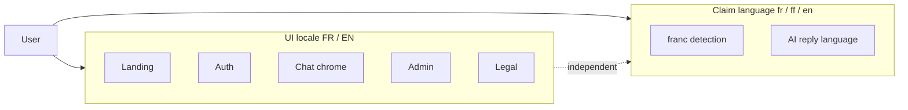

# Internationalisation (i18n) — FR / EN product translation

**Status:** Partial — core infrastructure and most web chrome bundles exist; audit and E2E coverage remain.

**Default locale:** `fr` (French)

**Supported UI locales:** `fr` | `en`

**Related feature specs:** [feat-0029](./feat-0029/PRODUCT.md) (locale switcher), [feat-0034](./feat-0034/PRODUCT.md) (full EN coverage), [feat-0014](./feat-0014/PRODUCT.md) (claim language, separate concern).

---

## 1. Summary

Every **user-facing product string** in the Afalambe web app must exist in **French and English**. French is the **default** when no preference is stored, when the browser language is not English, or when the user selects French.

This spec covers **product chrome** (navigation, labels, buttons, toasts, metadata, legal copy, admin UI). It does **not** require machine translation of **user-authored claim text** or **AI replies**.



---

## 2. Two language systems (do not conflate)

| System | Codes | Purpose | Storage | Spec |
|--------|-------|---------|---------|------|
| **UI locale** | `fr`, `en` | Buttons, nav, toasts, page titles | `localStorage` `afalambe_locale` + cookie `afalambe_locale` | This document |
| **Claim language** | `fr`, `ff`, `en` | Language of submitted claim text; AI reply preference | `Claim.claimLanguage` (per thread) | [feat-0014](./feat-0014/PRODUCT.md) |

**Rules:**

1. Changing UI locale must **not** change `claimLanguage` on existing claims or re-run AI.
2. UI locale and claim language may differ (e.g. English UI + Fulfulde claim).
3. **Fula (`ff`)** is supported for **claims only**, not for product chrome in MVP.

---

## 3. Default and resolution order

### 3.1 UI locale (client)

Implemented in [`apps/web/lib/ui-locale.ts`](../apps/web/lib/ui-locale.ts) `resolveInitialUiLocale()`:

1. `localStorage.afalambe_locale` if `fr` or `en`
2. Else `navigator.language` → `en` if browser primary tag is `en`, otherwise **`fr`**
3. Server / SSR fallback: **`fr`**

### 3.2 UI locale (server metadata)

[`apps/web/lib/locale-cookie.ts`](../apps/web/lib/locale-cookie.ts) `getServerUiLocale()` reads the `afalambe_locale` cookie for `generateMetadata` on auth, legal, and admin pages.

### 3.3 Claim language

[`apps/web/lib/language-detection.ts`](../apps/web/lib/language-detection.ts) on **new claim create** only; default `fr` when detection is inconclusive.

---

## 4. Architecture

### 4.1 Message bundles (single source of truth)

| Bundle | File | Covers |
|--------|------|--------|
| `AUTH_MESSAGES` | `ui-locale.ts` | Auth form labels, validation, errors |
| `VERIFY_MESSAGES` | `ui-locale.ts` | Email verification form |
| `RESET_PASSWORD_MESSAGES` | `ui-locale.ts` | Reset password form |
| `REQUEST_RESET_MESSAGES` | `ui-locale.ts` | Forgot-password form + toasts |
| `AUTH_PAGES` | `ui-locale.ts` | Auth shell titles, descriptions, metadata |
| `AUTH_FOOTER` | `ui-locale.ts` | Auth page footer prompts |
| `CHAT_UI` | `ui-locale.ts` | Sidebar, composer, verdict labels, copy |
| `CHAT_TOASTS` | `ui-locale.ts` | Chat send/upload/regenerate toasts |
| `CHAT_HOME_UI` | `ui-locale.ts` | Empty-state example columns |
| `CHAT_CLAIM_LABELS` | `ui-locale.ts` | Claim metadata field labels |
| `IMAGE_VALIDATION_MESSAGES` | `ui-locale.ts` | Image upload validation errors |
| `COMMON_UI` | `ui-locale.ts` | Loading, back |
| `ADMIN_UI` | `ui-locale.ts` | Queue, claim detail, guard |
| `ADMIN_PAGE_META` | `ui-locale.ts` | Admin page titles |
| `LEGAL_DOCUMENT_UI` | `ui-locale.ts` | Legal chrome (updated, draft notice) |
| `LEGAL_PAGE_META` | `ui-locale.ts` | Legal page metadata |
| `LANDING_CONTENT` | `landing-content.ts` | Marketing hero, FAQ, features, nav |
| Legal body | `legal-content.ts` | Privacy + terms sections per locale |
| Site SEO | `site.ts` | Descriptions, keywords per locale |
| Prompt suggestions | `languages.ts` | Chat home examples (`fr` / `ff` / `en`) |

**Parity rule:** Every key in `en` must have a `fr` counterpart (and vice versa) within each bundle.

### 4.2 Client hook

[`apps/web/hooks/use-ui-locale.ts`](../apps/web/hooks/use-ui-locale.ts):

- `locale`, `setLocale`, `toggleLocale`, `isReady`
- Sets `document.documentElement.lang` to `fr` or `en`
- Persists via `persistUiLocale()` (localStorage + cookie)

### 4.3 Locale switcher

[`apps/web/components/locale-switcher.tsx`](../apps/web/components/locale-switcher.tsx) — visible on auth, chat, landing, legal, admin chrome.

### 4.4 Shared UI package (`@afalambe/ui`)

**No hooks inside `packages/ui`.** Callers pass translated strings as props (`placeholder`, `signInLabel`, `heroTitle`, etc.). French defaults in kit components are legacy fallbacks; web app must pass locale-aware props.

### 4.5 API / tRPC errors

Server may return French or English `TRPCError.message`. Client surfaces user-visible text via [`apps/web/lib/api-toast.ts`](../apps/web/lib/api-toast.ts) `getApiErrorMessage()`. Long-term: stable error codes mapped to `COMMON_UI` / domain bundles on the client.

### 4.6 Email templates

**Out of scope for UI i18n MVP.** Transactional emails remain French until [feat-0011](./feat-0011/PRODUCT.md) adds locale policy.

---

## 5. Surface inventory — every part of the app

### 5.1 Marketing (`/`)

| Element | FR (default) | EN | Implementation |
|---------|--------------|-----|----------------|
| Header nav, CTAs | Required | Required | `landing-content.ts` → `landing-page-client.tsx` |
| Hero title, buttons, placeholder | Required | Required | `landing-content.ts` |
| Steps, why bullets, FAQ | Required | Required | `landing-content.ts` |
| Feature cards | Required | Required | `landing-features.tsx` + content bundle |
| Hero chat preview samples | Required | Required | Props to `landing-hero-chat-preview.tsx` |
| Footer links | Required | Required | UI kit props |
| FAQ JSON-LD `inLanguage` | `fr` | `en` | Must match visible FAQ locale |
| Page metadata (title, description) | Required | Required | Cookie-aware `generateMetadata` on `/` |

### 5.2 Authentication

| Route | Elements | Bundle |
|-------|----------|--------|
| `/sign-in` | Shell, form, metadata, footer | `AUTH_PAGES.signIn`, `AUTH_MESSAGES`, `AUTH_FOOTER` |
| `/sign-up` | Shell, form, metadata, footer | `AUTH_PAGES.signUp`, `AUTH_MESSAGES`, `AUTH_FOOTER` |
| `/sign-up/verify` | Shell, OTP form, metadata | `AUTH_PAGES.verify`, `VERIFY_MESSAGES` |
| `/forgot-password` | Shell, form, metadata, toasts | `AUTH_PAGES.forgotPassword`, `REQUEST_RESET_MESSAGES` |
| `/reset-password` | Shell, form, metadata | `AUTH_PAGES.resetPassword`, `RESET_PASSWORD_MESSAGES` |

**Shell:** [`localized-auth-page-shell.tsx`](../apps/web/components/localized-auth-page-shell.tsx)

### 5.3 Chat (`/chat` and authenticated home)

| Element | FR | EN | Bundle / notes |
|---------|----|----|----------------|
| Sidebar (threads, search, new) | Required | Required | `CHAT_UI` |
| Composer placeholder, aria | Required | Required | `CHAT_UI` |
| Verdict badges | Required | Required | `CHAT_UI` |
| Home empty-state columns | Required | Required | `CHAT_HOME_UI` |
| Example prompts | Required | Required | `languages.ts` `PROMPT_SUGGESTIONS` |
| Toasts (send, image, clear) | Required | Required | `CHAT_TOASTS` |
| Image validation errors | Required | Required | `IMAGE_VALIDATION_MESSAGES` |
| Copy-to-clipboard feedback | Required | Required | `CHAT_UI` |
| Claim metadata labels | Required | Required | `CHAT_CLAIM_LABELS` |
| Outbox failed banner | Required | Required | `CHAT_UI` |
| Typing indicator | Required | Required | `CHAT_UI` |

**Not translated (by design):** user message bodies, AI reply text, attachment filenames.

### 5.4 Admin (`/admin/*`)

| Surface | FR | EN | Bundle |
|---------|----|----|--------|
| Guard loading | Required | Required | `ADMIN_UI` |
| Queue list, filters, audit | Required | Required | `ADMIN_UI` |
| Claim detail, resolve form | Required | Required | `ADMIN_UI` |
| Page metadata | Required | Required | `ADMIN_PAGE_META` |
| Status enum raw values (`OPEN`, …) | Keep as-is | Keep as-is | Localized **labels** only where shown |

### 5.5 Legal

| Route | FR | EN | Source |
|-------|----|----|--------|
| `/legal/privacy` | Required | Required | `legal-content.ts` + `LEGAL_DOCUMENT_UI` |
| `/legal/terms` | Required | Required | `legal-content.ts` + `LEGAL_DOCUMENT_UI` |
| Page metadata | Required | Required | `LEGAL_PAGE_META` |

English legal copy is **provisional** until legal review ([feat-0017](./feat-0017/PRODUCT.md)).

### 5.6 System pages

| Page | FR | EN | Notes |
|------|----|----|-------|
| `not-found.tsx` | — | Primary | 404 copy |
| `error.tsx` / `global-error.tsx` | Required | Required | User-facing recovery text |
| Theme toggle aria | Required | Required | `COMMON_UI` or dedicated key |

### 5.7 API app (`apps/api`)

| Surface | FR | EN | Notes |
|---------|----|----|-------|
| tRPC `TRPCError.message` | Mixed today | Mixed today | User-visible strings should be stable; client maps where possible |
| AI system prompt | Multilingual instruction | Same | Responds in claim language, not UI locale |
| Email HTML | French | Future | feat-0011 |

### 5.8 Packages

| Package | i18n approach |
|---------|----------------|
| `@afalambe/ui` | Props only; no locale state |
| `@afalambe/trpc` | Error messages; no UI bundles |
| `@afalambe/emails` | French templates (MVP) |

---

## 6. Copy principles and glossary

### 6.1 Tone

- **French:** Plain, professional; primary audience for Afalambe.
- **English:** Mirror information density; avoid literal calques from French.

### 6.2 Glossary (use consistently)

| French (UI) | English (UI) | Notes |
|-------------|--------------|-------|
| Dossier | Claim / file | Context-dependent |
| Verification des faits | Fact-checking | |
| File d'attente | Review queue | Admin |
| Connexion | Sign in | |
| Commencer | Get started | |
| Langue | Language | Claim metadata only |

### 6.3 Do not translate

- Brand: **Afalambè** / **Afalambe**
- Enum codes in tables (`VERIFIED`, `OPEN`)
- User-authored claim text
- URLs, email addresses

---

## 7. Use case catalog

### Locale behaviour

| ID | Use case | Acceptance | Status |
|----|----------|------------|--------|
| **UC-I18N01** | User switches UI to English | All chrome in §5 updates without reload | Partial |
| **UC-I18N02** | French default when no preference | `resolveInitialUiLocale()` → `fr` | Implemented |
| **UC-I18N03** | Reload preserves locale | `localStorage` + cookie | Implemented |
| **UC-I18N04** | `<html lang>` matches locale | `fr` or `en` on client | Implemented |
| **UC-I18N05** | Locale switcher on all product routes | Landing, auth, chat, admin, legal | Implemented |
| **UC-I18N06** | UI locale independent of claim language | Toggle does not mutate `claimLanguage` | Implemented |
| **UC-I18N07** | Server metadata respects cookie | Auth, legal, admin `generateMetadata` | Implemented |
| **UC-I18N08** | Landing metadata respects cookie | `/` title and description | Partial |
| **UC-I18N09** | FAQ JSON-LD matches visible locale | `inLanguage` on structured data | Partial |
| **UC-I18N10** | No French chrome when `en` selected | Grep audit with allowlist | Not implemented |
| **UC-I18N11** | E2E smoke EN path | Playwright `locale-en.spec.ts` | Partial |
| **UC-I18N12** | Bundle parity test | Every `en` key has `fr` twin | Partial (`ui-locale.test.ts`) |
| **UC-I18N13** | Persist locale on User profile | `User.preferredLocale` after login | Not implemented |

---

## 8. Delivery phases

| Phase | Scope | Outcome |
|-------|-------|---------|
| **0** (done) | `UiLocale`, hook, switcher, cookie, core bundles | feat-0029 foundation |
| **1** | Landing + JSON-LD + site metadata | UC-I18N08, UC-I18N09 |
| **2** | Remaining hardcoded strings in web client | UC-I18N01, UC-I18N10 |
| **3** | E2E + grep CI + bundle parity | UC-I18N11, UC-I18N12 |
| **4** (optional) | Email EN, `User.preferredLocale`, `/en` URL prefix | feat-0011, feat-0029 UC-I18N05 |

---

## 9. Implementation patterns

### 9.1 Client component

```ts
const { locale } = useUiLocale();
const t = CHAT_TOASTS[locale];
notifyApiWarning({ title: t.imageRejectedTitle, description: t.imageRejected });
```

### 9.2 Server metadata

```ts
export async function generateMetadata(): Promise<Metadata> {
  return createAuthPageMetadata('signIn');
}
```

### 9.3 Validation errors

Return stable codes from pure functions; map to `IMAGE_VALIDATION_MESSAGES[locale]` at the call site.

### 9.4 Plurals

MVP: explicit FR/EN branches (`{count} dossier` / `{count} claims`). Future: `Intl.PluralRules` or ICU messages.

---

## 10. Testing

| Test | Location | Purpose |
|------|----------|---------|
| Bundle parity | `apps/web/lib/ui-locale.test.ts` | FR/EN key symmetry |
| Landing parity | `apps/web/lib/landing-content.test.ts` | FAQ/steps count match |
| E2E English | `tests/e2e/auth-pages-en.spec.ts`, `locale-en.spec.ts` | UC-I18N11 |
| E2E French | `tests/e2e/auth-pages.spec.ts` | No regression on default |
| Grep audit | CI script | UC-I18N10 — flag French in `.tsx` outside bundles |

---

## 11. Non-goals

- Machine translation of claims or AI output
- Fula (`ff`) product chrome
- RTL layout
- **`/fr/*` URL prefix** — see [I18N_ROUTED_SPEC](./I18N_ROUTED_SPEC.md) for `/en/*` English paths
- Localizing Resend templates in this spec (track under feat-0011)

> **Routing:** Cookie-only locale (this doc) is the current implementation. Target architecture is [I18N_ROUTED_SPEC](./I18N_ROUTED_SPEC.md): French at `/chat`, English at `/en/chat`.

---

## 12. Acceptance criteria (definition of done)

1. With `afalambe_locale=fr` (or unset), the full product journey matches authoritative French copy.
2. With `afalambe_locale=en`, a user can browse landing → sign in → chat → admin (if role) → legal **without French product chrome**.
3. Toggling locale does not change claim language or re-trigger AI.
4. All bundles in §4.1 maintain FR/EN parity (automated test).
5. `<html lang>` and page metadata align with active locale on auth, legal, admin, and landing.
6. UC-I18N10 grep audit passes with documented allowlist (brand name, user content, enum codes).

---

## 13. File map (quick reference)

```
apps/web/
  lib/ui-locale.ts          # Primary message bundles
  lib/landing-content.ts    # Marketing copy
  lib/legal-content.ts      # Legal body copy
  lib/locale-cookie.ts      # Server locale from cookie
  lib/page-metadata.ts      # generateMetadata helpers
  lib/languages.ts          # Claim language + prompt suggestions
  hooks/use-ui-locale.ts    # Client locale state
  components/locale-switcher.tsx
  components/landing-page-client.tsx
  components/localized-auth-page-shell.tsx
  components/legal-page-client.tsx
packages/ui/                # Props only — no locale hooks
```

---

## 14. Related documents

| Document | Role |
|----------|------|
| [feat-0029 PRODUCT](./feat-0029/PRODUCT.md) | Locale switcher feature |
| [feat-0034 PRODUCT](./feat-0034/PRODUCT.md) | Full EN coverage checklist |
| [feat-0014 PRODUCT](./feat-0014/PRODUCT.md) | Claim language detection |
| [web.md](./web.md) FR-W-4 | Web i18n requirement |
| [feat-0018](./feat-0018/PRODUCT.md) | SEO, `html lang`, metadata |
