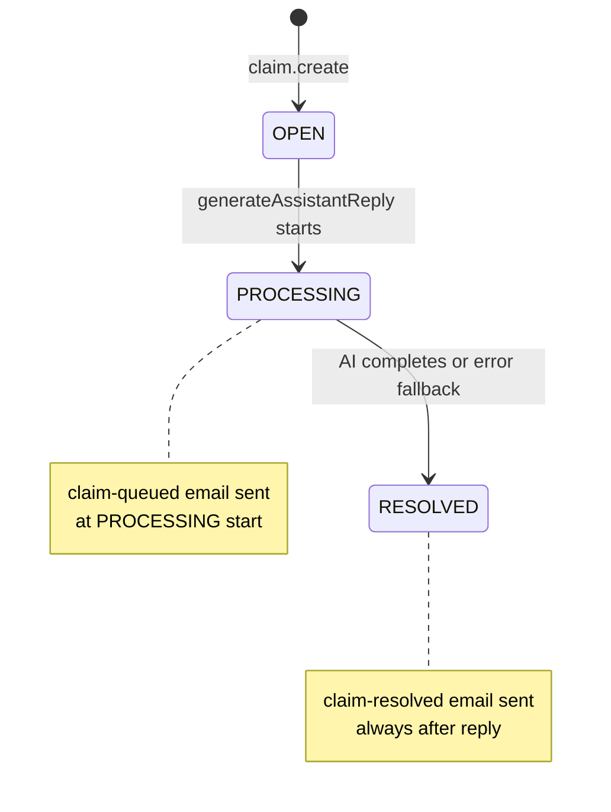

# feat-0030: Claim lifecycle, verdicts, and notification triggers

## Summary

Defines the **end-to-end life of a Claim**: status fields, fact-check verdict, when emails fire, and how assistant output maps to `factCheckStatus`. This is the **source of truth** for behavior today vs the human-queue product promise.

Complements [feat-0006](../feat-0006/PRODUCT.md), [feat-0007](../feat-0007/PRODUCT.md), [feat-0011](../feat-0011/PRODUCT.md).

## State machine (implemented today)

**Not used today:** `FAILED`, true human queue hold, `OPEN` after failed AI.

## Dual status fields

| Field | Enum | Meaning |
|-------|------|---------|
| `status` | `ClaimStatus` | Pipeline: OPEN, PROCESSING, RESOLVED, FAILED |
| `factCheckStatus` | `FactCheckStatus` | Verdict: PENDING, VERIFIED, DEBUNKED, MISLEADING, PARTIALLY_TRUE |

On create: `status=OPEN`, `factCheckStatus=PENDING` (default).

## Verdict parsing (product)

Assistant text scanned for English tokens (case-insensitive):

- `verified` → VERIFIED
- `debunked` → DEBUNKED
- `misleading` → MISLEADING
- `partially true` / `partially_true` → PARTIALLY_TRUE

If no match: `factCheckStatus` stays **unchanged** (usually PENDING).

## Email triggers (actual behavior)

| Email | When | Idempotency key pattern |
|-------|------|-------------------------|
| `claim-queued` | Start of **every** `generateAssistantReply` | `claim-queued:{userId}:{claimId}:processing` |
| `claim-resolved` | End of **every** `generateAssistantReply` (success or fallback text) | `claim-resolved:{userId}:{claimId}:resolved` |

**Product gap:** Emails imply human queue + resolution; in reality both fire on **synchronous AI** runs. Target: only queue when escalating to human ([feat-0028](../feat-0028/PRODUCT.md)).

## AI failure behavior

| Event | User sees | `status` | `factCheckStatus` |
|-------|-----------|----------|-------------------|
| OpenAI error / timeout | French fallback apology | RESOLVED | Usually PENDING (no verdict token) |

## Use case catalog

| ID | Use case | Expected |
|----|----------|----------|
| **UC-LC01** | New claim | OPEN + PENDING |
| **UC-LC02** | AI starts | PROCESSING + queued email |
| **UC-LC03** | AI returns "VERIFIED: ..." | RESOLVED + VERIFIED + resolved email |
| **UC-LC04** | AI returns no verdict keyword | RESOLVED + PENDING + resolved email |
| **UC-LC05** | Follow-up message | append only; new `generateAssistantReply` repeats LC02–04 |
| **UC-LC06** | Human escalation (target) | FAILED or PROCESSING without auto-resolve |

## Acceptance criteria (target product)

1. `claim-queued` only when claim enters human queue or async job.
2. `claim-resolved` when user-visible outcome is final.
3. AI failure sets `FAILED` or keeps PROCESSING for reviewer — not silent RESOLVED.

## Related

- [feat-0030 TECH](./TECH.md)
- [`claims-ai-pipeline.md`](../claims-ai-pipeline.md)
