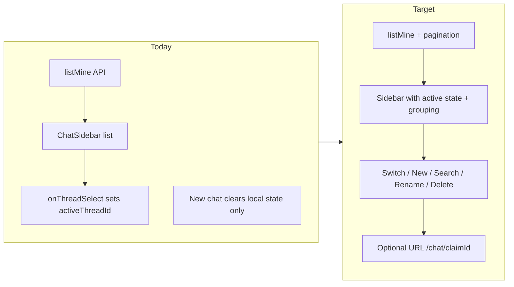

# feat-0037: Multiple chats in sidebar

## Summary

Users must be able to run **many independent fact-check conversations** from the chat sidebar: see them listed, start new ones, switch between them, search, and manage them over time. Each sidebar row maps to one persisted **Claim** thread ([feat-0006](../feat-0006/PRODUCT.md)).

This spec **completes** the ChatGPT-style sidebar experience. The API and basic list UI exist today; product gaps remain in selection state, thread management, empty/loading UX, and list freshness.

Complements [feat-0006](../feat-0006/PRODUCT.md), [feat-0024](../feat-0024/PRODUCT.md), [feat-0032](../feat-0032/PRODUCT.md), [feat-0029](../feat-0029/PRODUCT.md).

## Problem

Afalambe chat is modeled as multiple claims per user, and `claim.listMine` + `ChatSidebar` already render a thread list. In practice the sidebar does not yet feel like a reliable multi-chat workspace:

| Gap | Today |
|-----|-------|
| **Active thread** | No visual highlight for the open conversation |
| **"Clear conversations"** | Clears local selection only; label implies deletion |
| **Thread management** | No rename or delete from sidebar |
| **List limits** | Hard cap of 50 threads; no "load more" |
| **Empty history** | No dedicated empty-state copy when user has zero chats |
| **Deep link** | No URL to reopen a specific thread (`/chat` only) |
| **Collapsed sidebar** | No way to see or switch threads when collapsed |
| **Row context** | Title only; verdict/status not shown in list |
| **Date grouping** | Threads not grouped (Today / Previous) |

Users expect to start a second verification without losing the first, and to return to any past thread from the sidebar after refresh.

## Goals

| Goal | Detail |
|------|--------|
| **Many threads** | Verified user can create unlimited conversations (within rate limits); all appear in sidebar |
| **Switch threads** | Clicking a row loads that thread's messages in the main pane |
| **New chat** | "Nouveau chat" / "New chat" starts a fresh composer without affecting other threads |
| **Persist** | Thread list and messages survive refresh and re-login |
| **Find** | Search filters sidebar by title and claim text |
| **Manage** | Rename and delete individual threads |
| **Accessible** | Keyboard and screen-reader friendly thread list |

## Non-goals

- Shared or collaborative threads (multi-user on one claim)
- Folders, pins, or tags (phase 2)
- Cross-account thread export
- Admin visibility into user sidebar (see [feat-0020](../feat-0020/PRODUCT.md))
- Anonymous / demo threads without auth ([feat-0035](../feat-0035/PRODUCT.md) is separate)

## Actors

| Actor | Description |
|-------|-------------|
| **Verified user** | Creates, switches, searches, renames, and deletes own threads |
| **Unverified user** | Redirected to email verification; no thread list |

## Current vs target

## Use case catalog

### List and navigate

| ID | Use case | Trigger | Success |
|----|----------|---------|---------|
| **UC-MC01** | View thread history | Open `/chat` or `/en/chat` | Sidebar lists user's claims newest-first |
| **UC-MC02** | See active thread | Thread open in main pane | Active row highlighted in sidebar |
| **UC-MC03** | Switch thread | Click another row | Main pane loads selected messages; active highlight moves |
| **UC-MC04** | Empty history | User has zero claims | Sidebar shows empty-state message + prompt to start |
| **UC-MC05** | Loading history | `listMine` in flight | Skeleton or spinner in thread list area |
| **UC-MC06** | Group by recency | List has multiple threads | Sections: Today, Yesterday, Previous 7 days, Older (locale-aware labels) |

### Create

| ID | Use case | Trigger | Success |
|----|----------|---------|---------|
| **UC-MC10** | New chat | Click "New chat" | Composer empty; home empty state shown; no thread selected until first send |
| **UC-MC11** | First message creates thread | Submit in new-chat state | `claim.create`; new row appears at top of sidebar with auto title |
| **UC-MC12** | Follow-up in thread | Submit in active thread | `appendUserMessage`; row `updatedAt` refreshes; order may change |

### Search

| ID | Use case | Trigger | Success |
|----|----------|---------|---------|
| **UC-MC20** | Search threads | Type in sidebar search | `listMine({ search })` filters by title + claim text |
| **UC-MC21** | Clear search | Clear input | Full list restored |
| **UC-MC22** | No results | Search matches nothing | "No chats found" message (FR + EN) |

### Manage

| ID | Use case | Trigger | Success |
|----|----------|---------|---------|
| **UC-MC30** | Rename thread | Row action → Rename | `claim.updateTitle`; sidebar title updates |
| **UC-MC31** | Delete thread | Row action → Delete → confirm | `claim.delete`; row removed; if active, return to new-chat state |
| **UC-MC32** | Replace "Clear conversations" | Footer action | Renamed to "Deselect chat" / "Clear selection" — only clears active thread locally (current behavior) |

### Pagination

| ID | Use case | Trigger | Success |
|----|----------|---------|---------|
| **UC-MC40** | Load more | User has >50 threads | "Load more" or infinite scroll fetches next page |
| **UC-MC41** | Stable order | New activity on old thread | Thread moves to top on `updatedAt` change |

### Optional (phase 2)

| ID | Use case | Notes |
|----|----------|-------|
| **UC-MC50** | Deep link thread | `/chat/[claimId]` and `/en/chat/[claimId]` open that thread |
| **UC-MC51** | Collapsed sidebar quick switch | Tooltip or popover with recent threads |
| **UC-MC52** | Verdict chip on row | Show DEBUNKED / VERIFIED badge when not PENDING |

## UX requirements

### Sidebar row content

| Field | Source | Display |
|-------|--------|---------|
| Title | `Claim.title` or first ~80 chars of first message | Truncated single line |
| Subtitle | `Claim.updatedAt` | Relative or locale-formatted time |
| Optional chip | `factCheckStatus` | Phase 2 |

### New chat behavior

1. Does **not** call API until first message (matches current implementation).
2. Does **not** remove or hide existing sidebar rows.
3. If user had unsent composer text in previous thread, show discard confirm (phase 2); MVP may clear without confirm.

### Delete behavior

1. Confirm dialog before delete (destructive).
2. Deletes claim, messages, and storage attachments (cascade).
3. Toast on success / failure (localized).

### i18n

All new strings in `CHAT_UI` ([feat-0029](../feat-0029/PRODUCT.md)): empty state, no results, rename, delete confirm, load more, date group headings, deselect label.

### Accessibility

| ID | Requirement |
|----|-------------|
| **A11Y-MC01** | Thread list is a `nav` with `aria-label` (existing) |
| **A11Y-MC02** | Active thread: `aria-current="page"` on active button |
| **A11Y-MC03** | Row actions reachable by keyboard |
| **A11Y-MC04** | Delete confirm traps focus |

## Acceptance criteria

1. User with 3+ claims sees all in sidebar (up to page size) and can switch between them.
2. Active thread is visually distinct from other rows.
3. "New chat" leaves existing threads intact and shows empty composer.
4. After creating a new claim, it appears at the top without full page reload.
5. Search filters the list; empty search result shows localized message.
6. User can rename and delete a thread; deleted thread disappears from list.
7. "Clear selection" (renamed footer action) does not delete server data.
8. FR and EN chrome for all new sidebar strings.
9. Unverified users never see thread list (existing auth guard).

## Open questions (decide in TECH)

| Question | Recommendation |
|----------|----------------|
| Delete hard vs soft? | Hard delete + cascade for MVP; add `deletedAt` later if audit needed |
| Pagination style? | Cursor on `updatedAt` + `id` |
| Deep link in MVP? | Phase 2 unless needed for email links |

## Related

- [feat-0037 TECH](./TECH.md)
- [feat-0006](../feat-0006/PRODUCT.md) — claim threads
- [feat-0024](../feat-0024/PRODUCT.md) — `ChatSidebar` kit
- [feat-0013](../feat-0013/PRODUCT.md) — outbox on follow-up sends
- [feat-0009](../feat-0009/PRODUCT.md) — realtime list invalidation
- Legacy [`chat.md`](../chat.md) — FR-C-2 new chat
